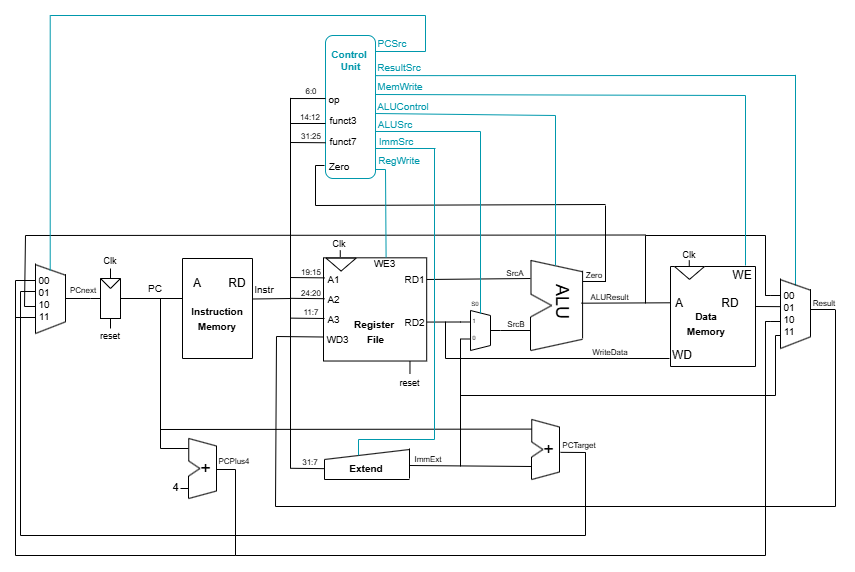

# Single-Core RISC-V CPU on Altera DE10-Nano

My implementation of a single-core RISC-V CPU on an Altera DE10-Nano FPGA as part of the IEEE Student Branch at Concordia University.


**Reference Textbook :** *Digital Design and Computer Architecture: RISC-V Edition* by Sarah L. Harris and David Harris.*

## Architecture Diagram



## Instructions Implemented

|Type       | Instructions Implemented  |
|------------------|----------------||
|R - Type |ADD, SUB, SLL, SLT, SLTU, XOR, SRL, SRA, OR, AND |
|I - Type | ADDI, ANDI, SLLI, SRLI, SRAI, SLTI, LW, JALR | 
|B- Type  | BEQ, BNE, BLT, BGE, BLT, BLTU, BGEU   |
|U- Type | LUI, AUIPC | 
|J-Type  | JAL | 

## Tools Used

- **Hardware:** Altera DE10-Nano FPGA
- **Languages:** SystemVerilog (design and testbenches)
- **Software:** Quartus Prime (synthesis), ModelSim (simulation), Git (version control)

## Directory Structure

<details>
<summary>Click to expand!</summary>

```
.
├── CPU_diagram.png
├── README.markdown
├── rtl
│   ├── ALU
│   │   ├── ALUMux.sv
│   │   ├── ALU.sv
│   │   └── ALU_tb.sv
│   ├── ControlUnit
│   │   ├── ALUDecoder.sv
│   │   ├── ControlUnit.sv
│   │   └── MainDecoder.sv
│   ├── core_top
│   │   ├── single_core.sv
│   │   └── SingleCoreTop.sv
│   ├── datapath
│   │   ├── datapath.sv
│   │   └── ResultSrcMux.sv
│   ├── Extend
│   │   └── Extend.sv
│   ├── memory
│   │   ├── datamemory
│   │   │   └── datamem.sv
│   │   └── instructionmemory
│   │       └── instrutionmem.sv
│   ├── PC
│   │   ├── PCNextMux.sv
│   │   ├── PCPlus4.sv
│   │   ├── PC.sv
│   │   └── PCTarget.sv
│   └── register_file
│       └── regfile.sv
└── tb
    ├── ALU
    │   ├── ALUMux_tb.sv
    │   └── ALU_tb.sv
    ├── ControlUnit
    │   └── ControlUnit_tb.sv
    ├── core_top
    │   ├── single_core_tb.sv
    │   └── SingleCoreTop_tb.sv
    ├── datapath
    │   └── datapath_tb.sv
    ├── Extend
    │   └── Extend_tb.sv
    ├── memory
    │   ├── datamemory
    │   │   └── datamem.sv
    │   └── instructionmemory
    │       └── instructionmem_tb.sv
    ├── PC
    │   └── PC_tb.sv
    └── register_file
        └── regfile_tb.sv


```
</details>
